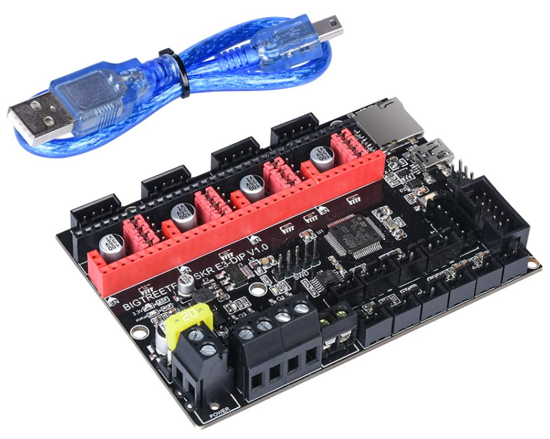
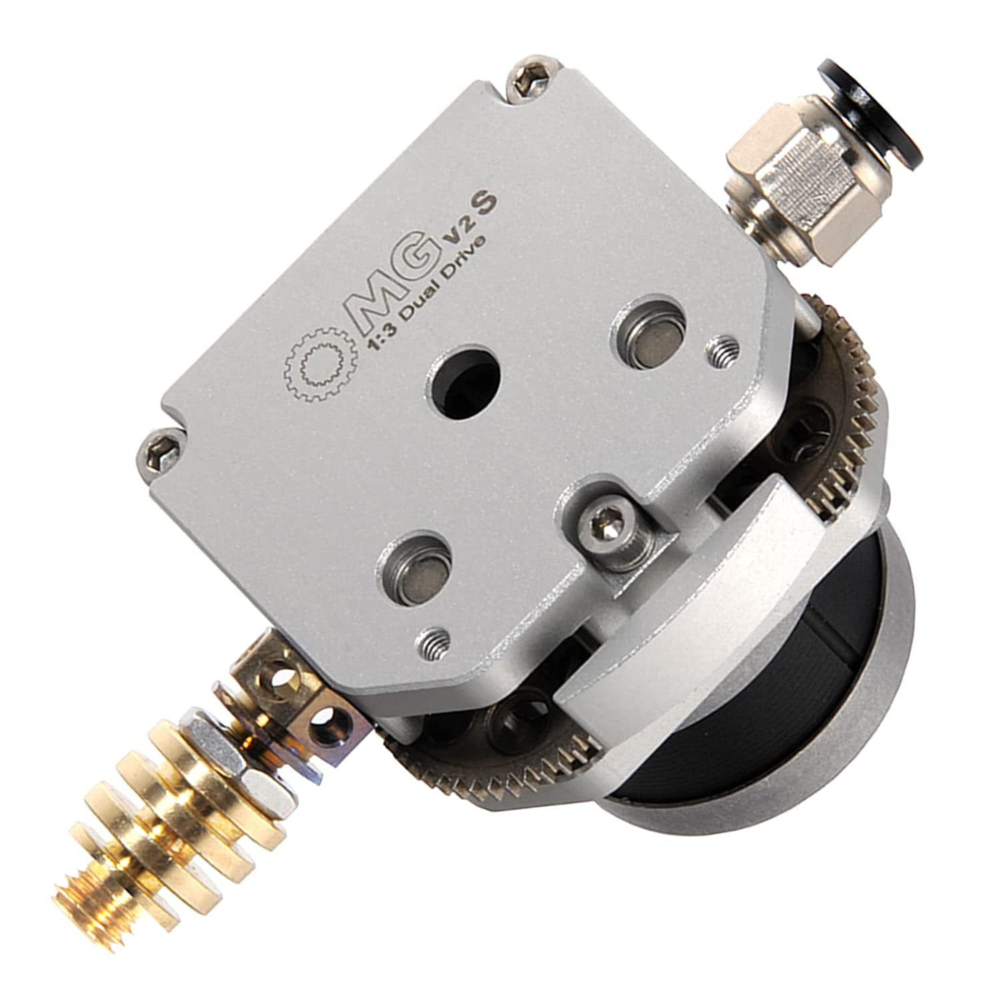
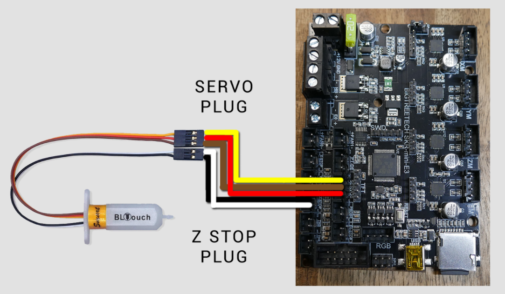
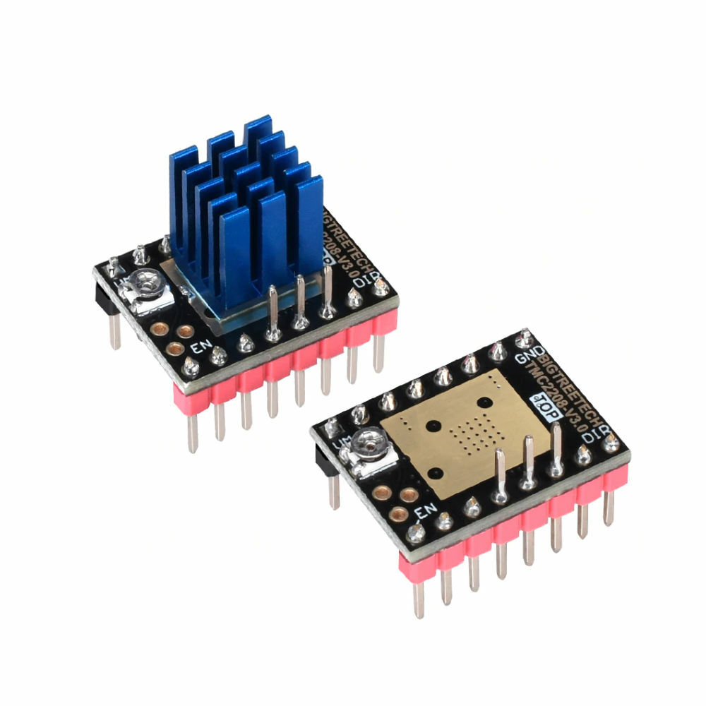
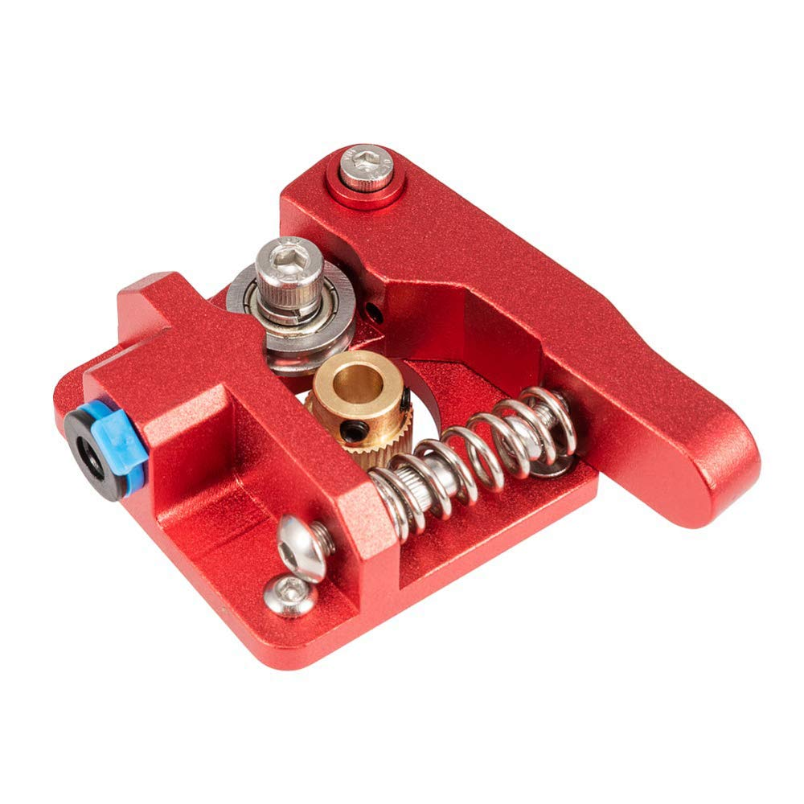

# Marlin-SKR-E3-DIP-V1.0

Custom configuration of Marlin firmware for SKR E3 DIP E3 V1.0 (Ender 3 Pro). Original resources:
* Motherboard manufacturer: https://github.com/bigtreetech/BIGTREETECH-SKR-E3-DIP-V1.0
* Marlin firmware: https://github.com/MarlinFirmware/Marlin

# Releases
    
## Marlin 2.0.9.1 (2021-09-22)
* Printer setup:
   * OMG V2 s extruder, direct drive (https://github.com/my3dltd/OMG-V2-S-Extruder-for-3D-Printer):
   
   
   * Fysetc (https://www.fysetc.com/) bltouch: 
   
    
   * Stepper drivers: TMC2208 UART
   
   
## Marlin 2.0.7.2 (2021-04-17)
* Printer setup:
   * Standard metal extruder, direct drive
   
      
   * Stepper drivers: TMC2208 UART
   
  

